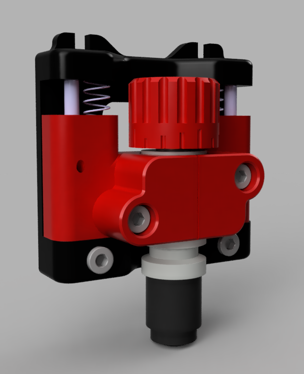
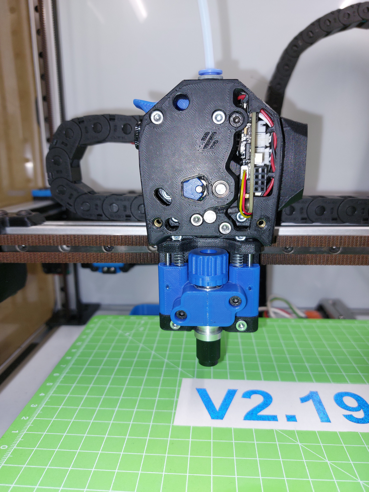
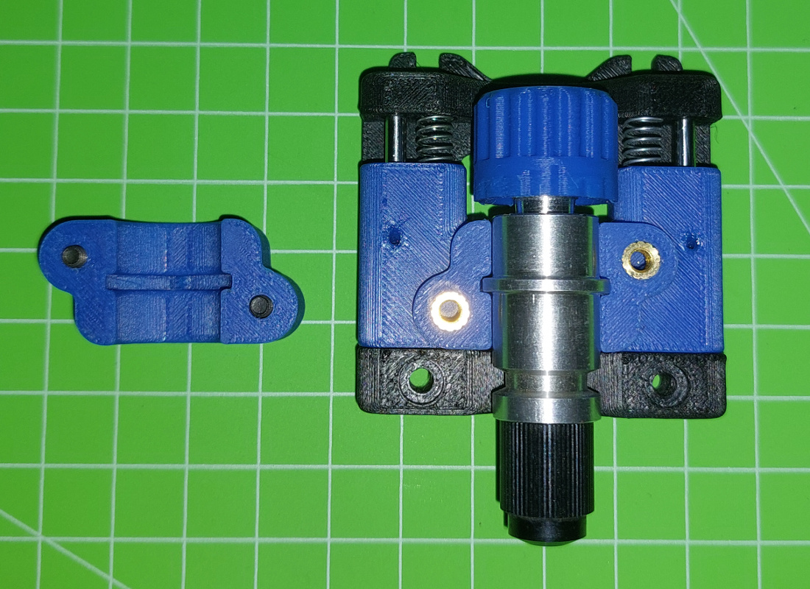

# Drag Knife Toolhead

This mod allows to mount a CB09 Graphtec blade holder to the VORON for cutting vinyl.

## BOM

Size | Qty
--- | ---
M3x8 SHCS | 2	
M3x16 SHCS | 2
Shaft 3x45 | 2
Spring 5.5x20 | 2
M2 Threaded Insert | 2
CB09 Drag Knife | 1

## Assembling

Use a 3 mm drill or reamer to enlarge the holes for the shaft in the drag knife slider. The shafts should slide easily but without play.

## create GCODE

 - [FlatCAM](http://flatcam.org/)
 - [dxf2gcode](https://sourceforge.net/projects/dxf2gcode/): Features a drag knife mode that includes offset correction for the blade.
 
 
